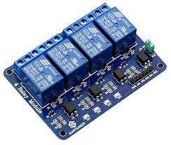

# Arduino-plays-Piano-Tiles
The game "Piano Tiles" is played by an Arduino
Hardware used:
1. A tablet or ipad
2. LDRs (Light dependent Resistors)
3. 4 channel Relay
4. Arduino
5. Coins

LDRs:
LDRs are resistors whose resistance depends on the intensity of light falling on it.

4 Channel Relay

Arduino

(https://www.youtube.com/watch?v=G0dqr979ccY)
